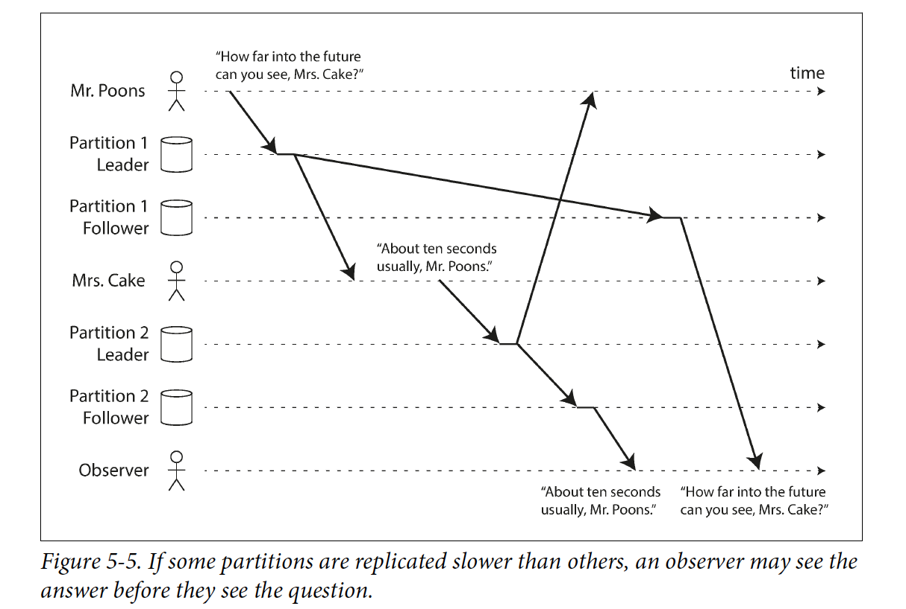

In Leader Based Replication, one node is designated as the leader, which receives write requests from clients, writes the new data to its local storage and also sends the data to all of its followers.

## Synchronous Versus Asychronous Replication
  * Synchronous 
    * Advantage: The follower is guaranteed to have an up-to-date copy of the data that is consistent with the leader. 
    * Disadvantage: If the synchronous follower does not respond, all writes will be blocked. 
    Typically, synchronous means one of the follower is synchronous and if the synchoronous follower becomes unavailable or slow, one of the
    asynchronous followers is made synchronous. This configuration is called semi-synchronous sometimes.
  * Asynchronous 
    * Advantage: the leader can continue processing writes, even if all of its followers have fallen behind.
    * Disadvantage: poential data loss.
  I may study chain replication if I have time.
## Setting Up New Followers
  1. Take a consistent snapshot of the leader's database at some point in time - if possible, without taking a lock on the entire database.
  2. Copy the snapshot to the new follewer node.
  3. The follower connects to the leader and requests all the data changes since the snapshot was taken. The snapshot is associated with an exact position in the leader's replication log.
  4. When the follower has processed the backlog of data changes since the snapshot, we say it has caught up.
## Handling Node Outages
  * Follower Failure: Catch-up recovery 
  connect to the leader and requst all the data changes since that last transaction before the outage.
  * Leader failure: Failover
    1. Determing that the leader has failed
    2. Choosing a new leader
    3. Reconfiguring the system to use the new leader. (the old leader may still believe that it is the leader)
     
    Failover is fraught with things that can go wrong:
    * If asynchronous replication is used, the new leader may have fallen behind, and there maybe conflicts if the former leader rejoins the cluster.
    * Discarding writes is dangerous if other storage systems outside of the database need to be coordinated with the database contents.
    * Split brain: if both leaders accept writes, and there is no process for resolving conflicts, data is likely to be lost or corrupted.
    * What is the right timeout
## Implementationof Replication Logs
  * Statemen-based replication
     
    there are various ways in which this approach can break down:
    * Statement that calls a nondeterministic function, such as NOW()
    * If statements use an autoincrementing column, or if they dpend on the existing data in the database, they must be executed in exactly the same order on each replica.
    * Statements that have side effects(e.g., triggers, stored procedures, user-defined functions) unless they are absolutely deterministic.
  * Write-ahead log(WAL) shipping
     
    Disadvantage: a WAL contains details of which bytes were changed in which disk blocks. This makes replication closely coupled to the storage engine.

  * Logical (row-based) log replication
     
    A logical log for a relational database is usually a sequence of records describing writes to database tables at the granularity of a row.
  * Trigger-based replication
    Register custom application code that is automatically executed when a data change occures.
## problems with Replication Lag
  * Reading Your Own Writes
    * When reading something that the user may have modified, read it from the leader.
    * Track the time of the last update and, for one minute after the last update, make all reads from the leader.
    * The client can remember the timestamp (logical or actual system clock) of its most recent write - then the system can ensure that the replica serving any reads for that user reflects updates at least until that timestamp.
   
  Another complication arises when the same user is accessing your service from multiple devices. In this case you may want to provide cross-device read-after-write consistency. In this case, there are some additional issues to consider:
    * Approaches that require remembering the timestamp of the user's last update become more difficult, because code running on one device doesn't know what updates have happened on the other device. This metadata will need to be centralized
  * Monotonic Reads
    The issue is if a user first reads from fresh replica, then from a stale replica, Time appears to go backward.
     
    Make sure each user always read from the same replica.
  * Consistent Prefix Reads
   
  

  
  Consistent prefix reads guarantees that if a sequence of writes happens in a certain order, then anyone reading those writes will see them in the same order.
   
  One solution is to make sure that any wirtes that are causally related to each other are written to the same partition.
## Solutions for Replication Lag
